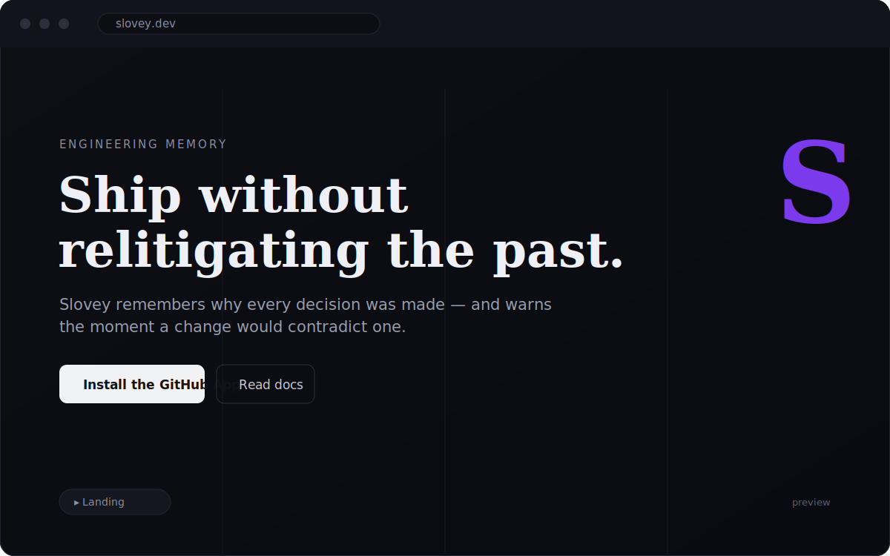
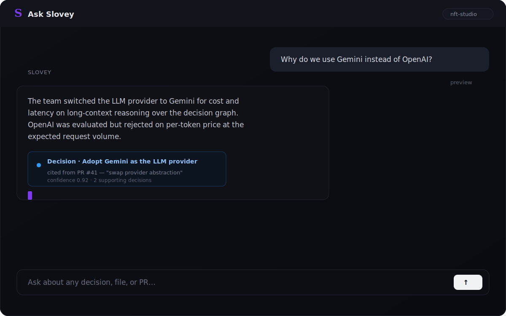
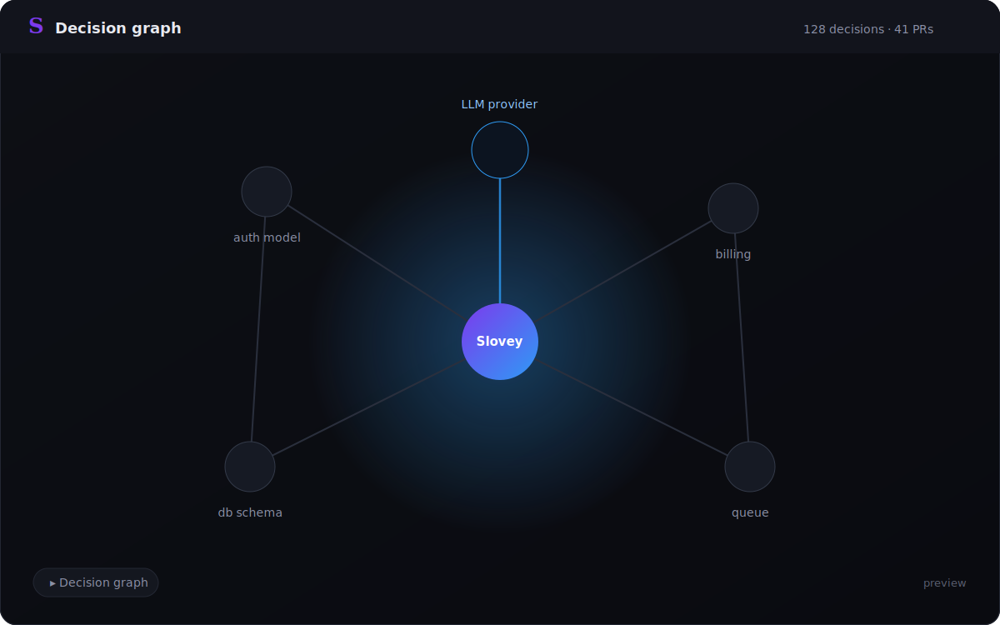
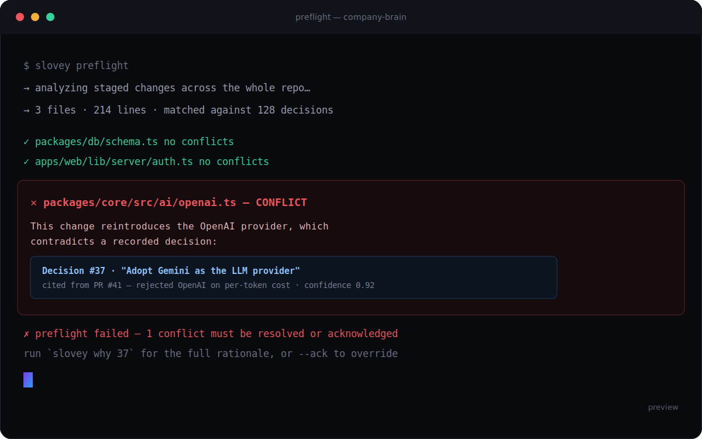
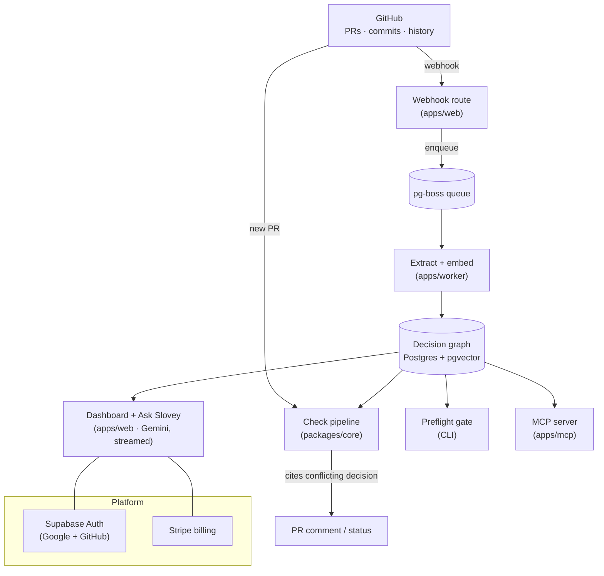

<div align="center">


# Slovey

**Engineering memory for teams &amp; AI agents.**

Slovey learns your team's decisions from GitHub history and blocks the pull requests<br/>
that contradict them — always citing the exact decision and the PR it came from.

<br/>

[](https://slovey.dev)
[](https://nextjs.org)
[](https://react.dev)
[](https://www.typescriptlang.org)
[](https://github.com/pgvector/pgvector)
[](https://orm.drizzle.team)
[](https://supabase.com)
[](https://stripe.com)
[](https://ai.google.dev)
[](https://pnpm.io)

[](https://github.com/gumballchief/slovey/commits)
[](https://github.com/gumballchief/slovey)
[](https://github.com/gumballchief/slovey)
[](https://github.com/gumballchief/slovey/stargazers)

**[🌐 slovey.dev](https://slovey.dev)** &nbsp;·&nbsp; [Quickstart](./docs/quickstart.md) &nbsp;·&nbsp; [Architecture](#-architecture) &nbsp;·&nbsp; [Roadmap](./docs/roadmap.md)

</div>

---

## The problem

Every team relitigates settled decisions. Someone swaps the auth model, reintroduces
a library the team already rejected, or breaks an invariant nobody wrote down — and it
sails through review because the *why* lived in a Slack thread from eight months ago.
AI coding agents make it worse: they have zero memory of your team's past calls.

**Slovey is the memory.** It reads your GitHub history, distills the durable decisions,
and checks every new change against them — so settled calls stay settled.

## Screenshots

<table>
  <tr>
    <td width="50%"></td>
    <td width="50%"></td>
  </tr>
  <tr>
    <td width="50%"></td>
    <td width="50%"></td>
  </tr>
</table>

<sub>Preview frames — swap in live captures anytime (see [`docs/screenshots`](./docs/screenshots)).</sub>

## What it does

| | Surface | What it does |
|---|---|---|
| 🧠 | **Decision graph** | Learns durable decisions from PRs &amp; commit history, embeds them into `pgvector`, and links each to the PR it came from. |
| 🛡️ | **Preflight gate** | A pre-commit / pre-PR check that scans the change against the **whole repo's** decisions and blocks anything that contradicts one — with a citation. |
| 💬 | **Ask Slovey** | "Why is it done this way?" — answered from the graph, streamed token-by-token, every claim cited to a decision + PR. |
| 🤖 | **GitHub App · MCP · agent** | The App comments on PRs automatically; the MCP server exposes the memory to any MCP-compatible agent; the worker's agent can open corrective PRs. |

## 🏗 Architecture

A pnpm monorepo. GitHub events flow through a durable queue into the decision graph;
every surface (dashboard, Preflight, MCP) reads from that one source of truth.



### Monorepo layout

```
apps/
  web/      # Next.js 16 dashboard + marketing site + API routes + webhook
  worker/   # pg-boss consumer (extract & check jobs), Preflight, repo indexer, eval, auto-PR agent
  mcp/      # MCP server — exposes the decision graph to any MCP-compatible agent
packages/
  core/     # product logic: ai/ embeddings/ github/ pipelines/ guardrails/ reasoning/ queue/ services/
  db/       # Drizzle schema + generated migrations + client (Postgres + pgvector)
  config/   # zod env validation + shared types
```

## 🛠 Tech stack

- **Frontend** — Next.js 16 (App Router, Turbopack), React 19, Tailwind CSS v4, SSE streaming.
- **Backend** — TypeScript everywhere, `packages/core` domain logic, pg-boss durable jobs.
- **Data** — Postgres + **pgvector** for embeddings, **Drizzle ORM** (schema-first, generated migrations).
- **AI** — pluggable LLM provider (**Gemini** default; Anthropic / OpenAI adapters) + pluggable embeddings (Voyage / OpenAI / Gemini).
- **Auth &amp; billing** — Supabase Auth (Google + GitHub OAuth, identity linking), Stripe.
- **Integrations** — GitHub App (webhooks + checks), MCP server.

## 🔒 Engineering highlights

Things I cared about building this, not just the happy path:

- **Multi-tenancy, enforced in code** — every install maps to an organization;
  `assertRepoAccess` / `assertRepoWrite` authorize by immutable GitHub account id
  (not a recyclable login) with role-gated writes. No org can touch another's repo.
- **Citation-or-silence** — the bot never speaks without citing a specific decision;
  a confidence floor + dedupe stop low-signal or double comments.
- **Durable, idempotent jobs** — webhooks return `202` in &lt;2s and hand off to pg-boss
  (retry with backoff, expiry); the heavy lifting is async in the worker.
- **Immutable audit log** — org-scoped rows for installs, checks, decision edits, and rebuilds.
- **Session hardening** — `@supabase/ssr` with a Next 16 `proxy` for token refresh, so
  Server Components stay authenticated across reloads.
- **Secrets stay out of git** — all credentials are env-injected; `.env` is git-ignored
  and `.env.example` ships only placeholders.

## 🚀 Quickstart

Full guide: **[docs/quickstart.md](./docs/quickstart.md)** — install the GitHub App (no
local setup) or wire the Preflight gate into your coding agent. To run the stack locally:

```bash
pnpm install
cp .env.example .env          # fill in secrets (never committed)

docker compose up -d          # Postgres + pgvector
pnpm db:migrate               # enable pgvector + apply migrations
pnpm seed                     # load prototype decisions (needs an embeddings key)

pnpm dev:web                  # dashboard on :3000
pnpm dev:worker               # job consumer
```

<details>
<summary><b>Useful scripts</b></summary>

| Command | What |
|---|---|
| `pnpm typecheck` | Type-check every package |
| `pnpm test` | Unit tests (citation guardrail, confidence floor, dedupe, webhook parsing) |
| `pnpm check` | Preflight: DB + pgvector + AI chat + embeddings connectivity |
| `pnpm db:generate` / `db:migrate` / `db:studio` | Drizzle migrations / studio |
| `pnpm seed` | Load the prototype's decisions for the test repo |
| `pnpm eval` | Eval harness (precision / recall / FP-rate per threshold) |
| `pnpm --filter @company-brain/worker sync` | Sync installations / orgs / repos from GitHub |
| `pnpm --filter @company-brain/worker index-repo` | Index a repo's architecture into `repo_knowledge` |

</details>

## 📚 Docs

[Quickstart](./docs/quickstart.md) · [Backend &amp; architecture](./BACKEND.md) · [Preflight](./docs/preflight.md) · [Auto-PR agent](./docs/agent-auto-pr.md) · [Billing setup](./docs/billing-setup.md) · [Roadmap](./docs/roadmap.md)

---

<div align="center">
<sub>Built by <a href="https://github.com/gumballchief">@gumballchief</a> · live at <a href="https://slovey.dev">slovey.dev</a></sub><br/>
<sub><i>Package identifiers are prefixed <code>@company-brain/*</code> — the project's original codename.</i></sub>
</div>
